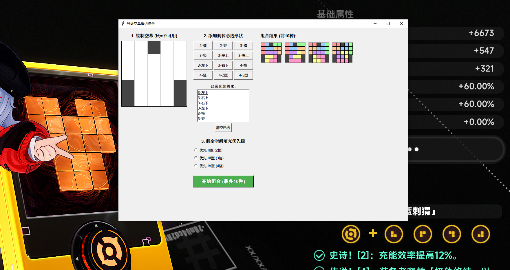
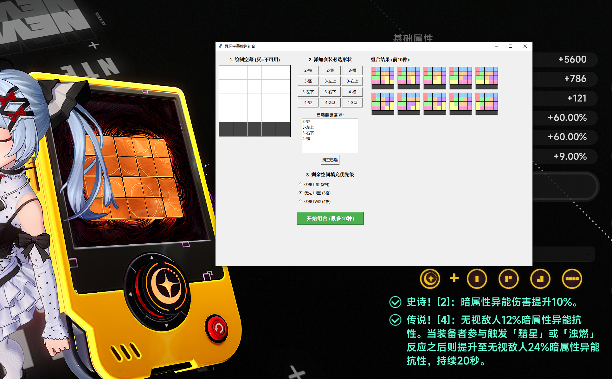

# NTE-DriveBlock-Solver (异环驱动块排列组合解算器)


这是一个基于 Python 和 Tkinter 开发的轻量级桌面应用程序，专门用于解决《异环》(Neverness to Everness, NTE) 游戏中的“空幕”驱动块排列组合问题。它可以帮助玩家在指定的网格空间内，根据必选套装形状和特定的填充优先级，快速计算并可视化出可行的拼图方案。

## 📸 界面预览





## ✨ 核心功能

*   **🎨 交互式空幕绘制**：支持在 5x5 的网格上通过点击或**丝滑拖拽**来绘制可用/不可用（灰色）区域，完美还原游戏内的空间限制。
*   **🧩 严格的形状库**：内置游戏内真实的 II型(2格)、III型(3格)、IV型(4格) 驱动形状。**严格遵守游戏规则：不可旋转、不可翻转**。
*   **📌 必选套装锁定**：支持添加一个或多个“必选形状”，算法会优先保证这些形状被放置在空幕中。
*   **💾 状态记忆与自动保存**：自动将当前的空幕布局、已选形状和优先级保存到本地，下次打开软件时无缝恢复上次的进度，告别重复配置。
*   **🛡️ 动态空间计算与防呆设计**：实时计算并显示剩余可用格子数。当剩余空间不足以放下某个形状时，对应的添加按钮会自动禁用，有效防止无效输入。
*   **⚙️ 智能填充优先级**：对于剩余的空间，玩家可以自定义填充优先级（优先使用 2格、3格 或 4格 形状填满）。
*   **📊 结果可视化**：使用深度优先搜索 (DFS) 结合回溯算法，快速计算出最多 10 种不同的可行方案，并用不同颜色直观地展示在右侧结果区。

## 🛠️ 环境依赖

本项目使用 Python 标准库开发，**无需安装任何第三方依赖**。

*   Python 3.6 或更高版本
*   Tkinter（通常随 Python 一起安装，无需额外配置）

## 🚀 快速开始

1. **克隆或下载本仓库**到本地：
   ```bash
   git clone https://github.com/NoroHime/NTE-DriveBlock-Solver.git
   ```

2. **运行程序**：
   双击运行 `空幕排列组合.pyw` 文件，或者在命令行中执行：
   ```bash
   python 空幕排列组合.pyw
   ```

## 📖 使用说明

1. **绘制空幕**：在左侧的 5x5 网格中，鼠标左键点击或拖拽可以切换格子的状态。白色代表可用空间，深灰色代表不可用空间。
2. **管理套装必选形状**：在中间区域，点击对应的按钮将您必须使用的形状加入到“已选套装需求”列表中。支持选中单个形状后点击“删除选中”进行微调，或直接“清空已选”。
3. **选择填充优先级**：在下方选择剩余空白区域优先使用哪种类型的方块来填充。
4. **开始组合**：点击绿色的“开始组合”按钮，程序将在右侧生成并绘制出可行的拼图方案（最多显示 10 种）。如果无解，下方会有红字提示具体原因。

## 🧠 算法简述

1. **面积预检**：首先计算必选形状的总面积，如果超过可用空幕面积则直接判定无解。
2. **整数划分**：计算剩余可用面积，并得出所有能用 2、3、4 组合填满该面积的“方块数量分配方案”。
3. **DFS 回溯搜索**：
   * 每次寻找最左上角的空位作为起点（减少搜索分支）。
   * 优先尝试放置必选形状。
   * 必选形状放置完毕后，按照计算好的分配方案放置剩余的填充形状。
   * 找到可行解后进行去重保存，直到找到 10 个解或遍历完毕。

## 🤖 致谢

本项目的代码编写与文档生成过程中，使用了人工智能辅助开发支持。

## 📄 许可证

本项目采用 [MIT License](LICENSE) 开源许可证。您可以自由地使用、修改和分发本软件。欢迎提交 Issue 或 Pull Request 共同完善！
